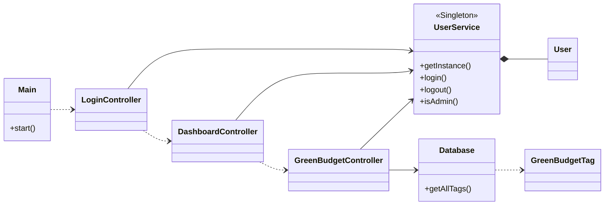

# Green Budget Manager

**Ομάδα ανάπτυξης:** CodeBlooded

### Μέλη Ομάδας
| Ονοματεπώνυμο | Αριθμός Μητρώου |
| :--- | :--- |
| **Κωνσταντίνος Φλώρος** | 8240157 |
| **Εμμανουήλ Ζερβός** | 8240049 |
| **Ιωάννης Αγάπης** | 8240001 |
| **Αλέξιος Ποθητάκης** | 8240116 |
| **Νικόλαος Ρήγας** | 8240120 |
| **Αλέξανδρος Αρίδας** | 8240229 |
| **Μύρων Πρεβελιανάκης** | 8240277 |
| **Αφροδίτη Κοτσιαλού** | 8220067 |

---

## 1. Οδηγίες Μεταγλώττισης

Για τη μεταγλώττιση του κώδικα και τη δημιουργία του εκτελέσιμου αρχείου, εκτελέστε στον ριζικό φάκελο:

```bash
mvn clean package
```

---

## 2. Οδηγίες Εκτέλεσης

> **Προσοχή:** Βεβαιωθείτε ότι το αρχείο `budget.db` βρίσκεται στον ίδιο φάκελο με το jar.

**Εκτέλεση μέσω τερματικού:**
```bash
java -jar target/GreenBudgetManager-1.0-SNAPSHOT.jar
```

(Εναλλακτικά μέσω Maven: `mvn javafx:run`)

---

## 3. Οδηγίες Χρήσης

* **Login:** Επιλογή εισόδου ως **Admin** (δικαιώματα επεξεργασίας) ή **Guest** (δικαιώματα προβολής).
* **Dashboard:** Κεντρικό μενού πλοήγησης και αποσύνδεσης.
* **Ανάλυση (Green Budget View):**
    * **Προβολή:** Πίνακας δεδομένων με οικονομικά στοιχεία και Green Tags.
    * **Αναζήτηση:** Φιλτράρισμα σε πραγματικό χρόνο με *Όνομα* και *Υπουργείο*.
    * **Επεξεργασία (Admin):** Διπλό κλικ στο κελί "Ποσό" για τροποποίηση τιμών.
    * **Γραφήματα:** Αυτόματη ενημέρωση διαγραμμάτων (Pie/Bar) βάσει φίλτρων.

---

## 4. Δομή Περιεχομένων Αποθετηρίου

```text
/src/main/java       -> Πηγαίος κώδικας Java (Controller, Model, Service, Database)
/src/main/resources  -> Αρχεία FXML, CSS και sql (view, sql)
/budget.db           -> Αρχείο βάσης δεδομένων SQLite
pom.xml              -> Ρυθμίσεις Maven (Dependencies/Build)
README.md            -> Τεχνική τεκμηρίωση
```

---

## 5. Διάγραμμα UML (Σχεδιασμός Κώδικα)



---

## 6. Επισκόπηση Δομών Δεδομένων & Αλγορίθμων

### Δομές Δεδομένων
* **ObservableList:** Σύνδεση δεδομένων μοντέλου με το UI (Data Binding).
* **DTO (GreenBudgetTag):** Μεταφορά σύνθετων δεδομένων από πολλαπλούς πίνακες της βάσης.
* **HashMap:** Ομαδοποίηση δεδομένων για τα γραφήματα.

### Αλγόριθμοι
* **Singleton:** Μοναδικό στιγμιότυπο διαχείρισης χρηστών (Authentication).
* **Filtering:** Γραμμική αναζήτηση (O(n)) με σύνθετα κριτήρια (Predicate).
* **Aggregation:** Υπολογισμός αθροισμάτων για ενημέρωση γραφημάτων.

---

## 7. Πρόσθετη Τεχνική Τεκμηρίωση

* **JavaDoc:** Πλήρης σχολιασμός κώδικα (Classes, Methods, Fields).
* **Unit Tests:** Έλεγχοι JUnit για τα Models και το Service layer.


---

## 8. Άδεια Χρήσης (License)

Το παρόν έργο διατίθεται υπό την άδεια **Apache License 2.0**. Για το πλήρες κείμενο της άδειας, ανατρέξτε στο αρχείο [LICENSE](LICENSE).
